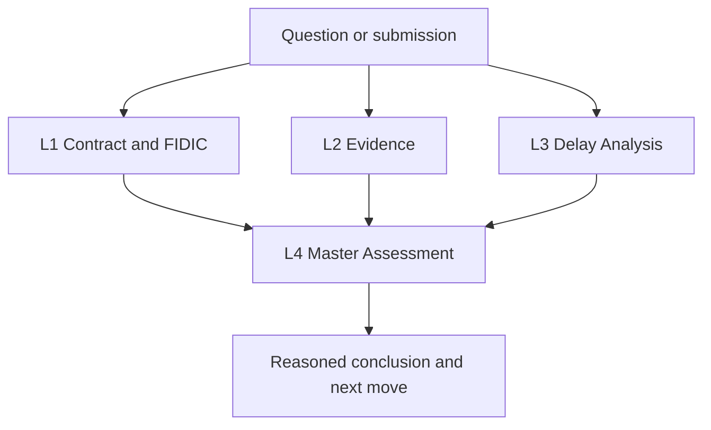

# ROYA-BIG PROJECT PHASE01 (B1-4)

## Contract, Evidence, Delay and Master Assessment Intelligence Package

Version: 1.0.0  
Status: Reusable controlled framework  
Project configuration: **ROYA-BIG PROJECT PHASE01 (B1-4)**

## Purpose

This package defines the operating logic for an evidence-backed construction contract and delay-analysis application. It applies four controlled analytical pipelines:

1. Contract and FIDIC Intelligence
2. Evidence Reader and Provider
3. Detailed Delay Analysis
4. Visual Master Assessment

The framework is project-agnostic. It does not inherit facts, dates, quantities, delay values, party responsibility, entitlement, or conclusions from any previous project. Every result must be derived from the active project's own signed contract, authorized FIDIC source, correspondence, registers, schedules and contemporaneous records.

## Package contents

| File | Purpose |
|---|---|
| `ROYA_BIG_MASTER_SPECIFICATION.md` | Complete functional, analytical and governance specification |
| `ROYA_BIG_IMPLEMENTATION_PROMPT.md` | Copy-ready prompt for Codex or another capable development agent |
| `PROJECT_INPUT_AND_DATA_TEMPLATE.md` | Required project data, folder structure and input registers |
| `ANALYSIS_AND_REPORT_TEMPLATES.md` | Standard outputs for all four pipelines |
| `VALIDATION_AND_ACCEPTANCE_PLAN.md` | Tests and release gates |
| `GENERIC_REUSE_PROMPT.md` | Prompt for applying the same logic to a different project |

## Non-negotiable principles

- Never invent a clause, quotation, date, record, schedule result or entitlement.
- Apply the signed contractual order of precedence before generic FIDIC logic.
- Distinguish verified wording from OCR text requiring visual confirmation.
- Separate facts, allegations, evidence, contractual interpretation, schedule effect and determination.
- Treat baseline information as the planned benchmark, not proof of actual delay or entitlement.
- Treat schedule movement as a technical result, not automatic EOT.
- Test notice, causation, criticality, mitigation, concurrency and time bars separately.
- Preserve source file, page, document reference, revision, date, hash and confidence for every conclusion.
- Show the Engineer's neutral assessment and recommended next procedural action.
- Prevent previous-project data from contaminating a newly created project.

## Application model

One Streamlit application should coordinate four separate engines. Each engine must be independently testable and must save structured outputs for the Master Assessment layer.

## Starting rule

On first use, create a clean project workspace and ingest only records belonging to **ROYA-BIG PROJECT PHASE01 (B1-4)**. If a source belongs to another project, quarantine it as `EXTERNAL_REFERENCE` and prohibit it from supporting a project conclusion unless an authorized user explicitly approves its relevance.

