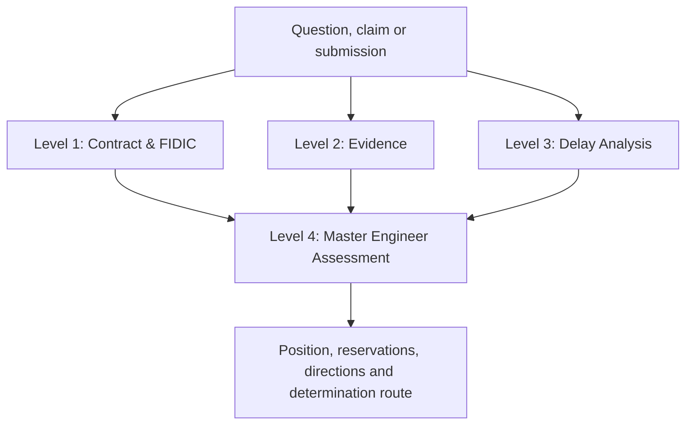

# THE BIG Contract, Evidence & Delay Intelligence Platform

## Complete Technical and Operating Guide — Version 1.6.0

**Project:** THE BIG — Phase 01  
**Contractor:** SAMCO  
**Purpose:** Contract administration, evidence governance, delay analysis and Engineer-side assessment  
**Document date:** 27 July 2026  
**Prepared for:** Project controls, contracts, commercial and senior management  
**Prepared by:** Eng. Ahmed Labib

---

## 1. Executive Summary

THE BIG Complete Intelligence Package v1.6.0 is a controlled four-level decision-support platform. It combines contractual interpretation, evidence management, Primavera P6 delay analysis and an integrated Engineer assessment without mixing the authority of the separate disciplines.

The platform is designed around one governance principle:

> A schedule movement is not automatically an entitlement, a document reference is not automatically evidence, and a generic FIDIC provision does not override the signed Contract.

The operating model comprises three independent specialist pipelines and one coordinating decision layer:

| Level | Pipeline | Primary question | Controlled output |
|---:|---|---|---|
| 1 | Contract & FIDIC Intelligence | What is the governing contractual position? | Contractual Position Pack |
| 2 | Evidence Reader & Provider | What facts and compliance can be proven? | Evidence Matrix, Chronology and Gap Register |
| 3 | Detailed Delay Analysis | What time effect is demonstrated by the submitted schedules? | Technical Delay Assessment |
| 4 | Master Engineer Assessment | What reasoned position and next action should follow? | Engineer Assessment and Determination Route |

Level 4 is a governance and synthesis layer. It does not create new contractual, factual or schedule evidence.

## 2. Controlled Architecture

### 2.1 Decision flow



### 2.2 Mandatory decision gates

The system should not issue an affirmative entitlement conclusion unless all relevant gates are addressed:

1. **Authority gate:** identify the governing document and apply the contractual order of precedence.
2. **Clause gate:** identify the applicable clause, amendment, condition, exception and cross-reference.
3. **Evidence gate:** verify authenticity, issue, receipt, date, content and evidential sufficiency.
4. **Procedure gate:** test notice, time bar, continuing particulars, monthly accounts and contemporary records.
5. **Causation gate:** demonstrate a credible cause-and-effect chain.
6. **Schedule gate:** validate the model, data date, calendars, logic, constraints and critical completion movement.
7. **Concurrency gate:** assess actual critical overlap once and avoid double counting.
8. **Mitigation gate:** evaluate reasonable mitigation without converting mitigation into risk transfer.
9. **Determination gate:** separate analytical position from the Engineer’s reasoned determination.

## 3. Level 1 — Contract & FIDIC Intelligence

### 3.1 Purpose

Level 1 establishes the governing legal and contractual route for a question, event, notice, claim or proposed letter.

### 3.2 Core capabilities

- Indexes all 34 signed Contract pages through a page- and passage-level OCR corpus.
- Searches words, phrases, clauses, definitions, exceptions and cross-references.
- Applies the contractual order of precedence.
- Separates verified signed wording from OCR passages requiring visual confirmation.
- Maps issues to FIDIC 1999 Clauses 1–20 without presenting the route map as verbatim copyrighted text.
- Supports ingestion of an authorized FIDIC PDF for page-level evidence.
- Identifies obligations, risk allocation, notice requirements, time bars and procedural conditions.
- Refuses unsupported conclusions instead of inventing provisions.
- Produces clause-backed analysis and controlled contractual letters.

### 3.3 Authority hierarchy

The engine applies the project-specific hierarchy encoded from the signed documents:

1. Contract Agreement
2. Appendix to Tender
3. Particular Conditions
4. FIDIC General Conditions, as amended

The exact hierarchy must always be visually confirmed against the signed Contract before a final legal quotation is issued.

### 3.4 Key project routes

| Issue | Principal route |
|---|---|
| Free-issue reinforcement steel / advance-payment mechanism | Appendix to Tender Item 20; Sub-Clause 14.2; amended Sub-Clause 4.20 |
| Programme and schedule administration | Amended Sub-Clause 8.3 |
| EOT, critical impact, method and mitigation | Amended Sub-Clause 8.4 |
| Drawings, instructions and revised IFC information | Sub-Clauses 1.5, 1.9 and 3.3 |
| Variations / additional MEP work | Sub-Clauses 3.3, 13.1 and 13.3 |
| Notices, particulars, records, monthly accounts and concurrency | Amended Sub-Clause 20.1 |

### 3.5 Contractual safeguards

- Mitigation is assessed as a duty to reduce the effect of delay; it does not automatically transfer Employer-risk responsibility to SAMCO.
- Forecast completion, contractual completion, EOT sought, EOT assessed and EOT awarded are separate values.
- A clause-route summary is not treated as a verified quotation.
- OCR evidence carries page and verification status.
- Final direct quotations must be checked against the signed PDF.

## 4. Level 2 — Evidence Reader & Provider

### 4.1 Purpose

Level 2 determines what is proven, what is supported, what conflicts, and what remains missing.

### 4.2 Evidence classes

The pipeline can process:

- Letters and notices
- RFIs and responses
- IFC drawings, revisions and transmittals
- Inspection Requests
- Verbal Instructions and Variation Orders
- Meeting minutes and progress reports
- Steel requests, delivery notes and material records
- Payment and advance-payment records
- Photographs and other contemporaneous records
- Approved baseline, schedule updates and XER submissions

### 4.3 Evidence status controls

| Status | Meaning | Permitted use |
|---|---|---|
| SOURCE_FILE_VERIFIED | Native source available and identity/provenance checked | May support a factual finding, subject to relevance and completeness |
| SOURCE_FILE_INDEXED | Source available and indexed but requires substantive review | Search lead and conditional support |
| REFERENCE_ONLY_UNVERIFIED | Reference exists but underlying source or receipt proof is absent | Cannot prove issue, receipt, content, compliance or entitlement |
| CONFLICTING | Sources materially disagree | Requires reconciliation before reliance |
| MISSING | Required source not supplied | Evidential gap and action item |

### 4.4 Approved baseline evidence

The approved-baseline adapter records:

| Dataset | Indexed volume |
|---|---:|
| Activities | 1,363 |
| Relationships | 3,017 |
| Resources | 120 |
| Resource assignments | 1,445 |

The baseline supports the planned benchmark, including logic, planned dates, resources and material need-date mapping. It does not independently prove occurrence, responsibility, notice compliance, actual critical delay, concurrency, EOT or cost.

### 4.5 Current critical evidence gaps

The following records remain reference-only or missing until their native files and proof of issue/receipt are supplied:

- STR-042 and STR-083
- ACEPM Letter No. 042
- BD-CW-SAMCO-ACE-LET-STR-071
- Engineer’s early warning / notification
- RFI register and individual responses
- IFC drawing register, revisions and transmittals
- IR STR-001 through STR-041
- VI and VO registers and signed instructions
- Monthly separate claim accounts
- Steel delivery notes, transmittals and acknowledged receipt records

These references must not be described as proven evidence merely because they appear in a narrative or register.

## 5. Level 3 — Detailed Delay Analysis

### 5.1 Purpose

Level 3 measures what the submitted P6 models demonstrate, then subjects the result to model-integrity controls.

### 5.2 Core tests

- Before/after XER pairing and internal data-date validation
- Fragnet activity identification
- Predecessor, successor and boundary-link tracing
- Calendar, relationship, lag and constraint screening
- Milestone and total-float comparison
- Common non-fragnet change screening
- Critical or controlling-path assessment
- Mitigation and concurrency review
- Gross movement, overlap and net movement reconciliation
- Separation of schedule result from contractual entitlement

### 5.3 Submitted-event results

The current controlled Level 4 position is:

| Event | Ground Works movement | Project-finish movement | Current control status |
|---|---:|---:|---|
| EV01 Batch 01 — Free-issue steel | 11 days in the submitted pair | 0 days retained in the current master position | Raw XER pair showed 8 days, later treated as absorbed by float; reconcile before final use |
| EV01 Batch 02 — Free-issue steel | 126 days | 117 days | Current controlled event movement |
| EV02 — Revised IFC / basement redesign | 78 days in raw event report | 71 days | 76-day raw model output is superseded by the later controlled Level 4 audit; reconciliation required |
| EV03 — MEP embedded works / variation | 7 days | 0 days | Not a controlled same-data-date comparison |

### 5.4 Current Level 4 reconciliation

| Measure | Controlled value | Qualification |
|---|---:|---|
| EV01 Batch 02 | 117 calendar days | Event-level project-finish movement |
| EV02 Revised IFC | 71 calendar days | Current controlled position; raw report recorded 76 days |
| Gross movement | 188 calendar days | 117 + 71 |
| Analytical overlap | 62 calendar days | Subject to final native P6/XER audit |
| Net EOT position | 126 calendar days | Subject to Contract, evidence and Engineer determination |
| Impacted forecast finish | 15-Sep-2027 | Forecast only; not an awarded EOT or revised contractual completion date |

### 5.5 Model-integrity warnings

#### EV03

- Filename date `DD25-13-2025` is invalid.
- Before-model internal data date: 25-Dec-2025.
- After-model internal data date: 17-Mar-2026.
- The pair cannot be treated as a controlled same-data-date TIA until reconciled.

#### EV02

- The detailed raw XER report records a 76-day project-finish movement.
- The subsequent controlled visual audit records 71 days and a 15-Sep-2027 forecast.
- The five-day variance must be reconciled to the exact schedule version, calendar basis, milestone selection and audit method before external submission.

#### General

- Date and float recalculation after fragnet insertion is expected.
- A full native-file differ is still required to confirm that unrelated changes do not contaminate attribution.
- Negative float indicates variance against a constraint or required date; it is not, by itself, proof of a controlling critical path or entitlement.

## 6. Level 4 — Master Engineer Assessment

### 6.1 Purpose

Level 4 combines the outputs of Levels 1–3 and produces a reasoned Engineer-side position.

### 6.2 Required outputs

- Executive issue statement
- Governing authority and clause route
- Proven and unproven facts
- Notice and procedural-compliance assessment
- Schedule reliability and critical-impact assessment
- Concurrency and double-counting assessment
- Mitigation assessment
- Time and cost separation
- Reservations and evidence directions
- Recommended interim or final determination route

### 6.3 Engineer’s recommended next move

1. Issue a neutral evidence-directions letter without prejudging entitlement.
2. Require an event-specific indexed file for steel, IFC and MEP events.
3. Require native documents and proof of issue/receipt for every relied-upon notice, letter, RFI, IFC, IR, VI and VO.
4. Test the amended Sub-Clause 20.1 notice period, continuing particulars, monthly separate accounts and contemporary-record compliance.
5. Reconcile each XER pair to the same approved update, data date and schedule options.
6. Audit calendars, constraints, open ends, relationships, lags, out-of-sequence settings and non-fragnet changes.
7. Assess each event independently before concurrency is introduced.
8. Determine actual critical overlap once; prevent double counting.
9. Separate EOT assessment from prolongation cost and other monetary entitlement.
10. Issue a reasoned interim or final determination with explicit assumptions, reservations and outstanding evidence.

## 7. Streamlit Operating Model

### 7.1 Recommended interface

Use one Streamlit application with four pages and isolated engine modules:

| Page | User task | Main output |
|---|---|---|
| Contract & FIDIC | Ask contractual questions, find clauses and draft controlled letters | Contractual position |
| Evidence Reader | Upload, classify, search and gap-test project records | Evidence matrix and chronology |
| Delay Analysis | Load XER pairs and assess event movement and integrity | Technical delay assessment |
| Master Assessment | Combine the three specialist outputs | Engineer view and next action |

### 7.2 Windows start-up

```powershell
cd "THE_BIG_COMPLETE_PACKAGE_v1.6.0"
py -m venv .venv
.\.venv\Scripts\Activate.ps1
python -m pip install -r requirements.txt
python the_big_contract_engine.py self-test
streamlit run the_big_contract_engine.py
```

The included `RUN_ENGINE.bat` provides the Windows launcher.

### 7.3 Key commands

```powershell
python the_big_contract_engine.py self-test
python the_big_contract_engine.py ask "Must SAMCO mitigate Employer-caused steel delay?"
python the_big_contract_engine.py evidence-search "STR-083"
python the_big_contract_engine.py engineer-next
python the_big_contract_engine.py delay-events
python the_big_contract_engine.py rebuild-delay-events
python build_fidic_corpus.py ".\FIDIC 1999 Red Book.pdf"
```

## 8. Package Contents

| Component | Purpose |
|---|---|
| `the_big_contract_engine.py` | Main Streamlit and CLI application |
| `the_big_contract_brain.json` | Controlled project contractual knowledge |
| `Overall Contract.pdf` | Signed source Contract |
| `contract_evidence_corpus.json` | 34-page Contract OCR retrieval corpus |
| `fidic_1999_clause_routes.json` | Non-verbatim FIDIC 1999 routing map |
| `build_contract_corpus.py` | Contract corpus builder |
| `build_fidic_corpus.py` | Authorized FIDIC corpus builder |
| `evidence_intelligence.py` | Evidence classification and Engineer-action logic |
| `evidence_register.json` | Controlled evidence register |
| `approved_baseline_intelligence.py` | Baseline evidence adapter |
| `xer_delay_analysis.py` | Native XER event analysis |
| `delay_events_detailed.json` | Machine-readable delay-event register |
| `DELAY_EVENTS_DETAILED_REPORT.md` | Event-by-event technical report |
| `level_4_visual_assessment/` | Approved Level 4 illustration and diagram audit |
| `audited_superseded_diagrams/` | Retained originals; not approved for unqualified use |
| `RUN_ENGINE.bat` | Windows launcher |
| `requirements.txt` | Python dependencies |

## 9. Validation and Quality Controls

The unified release records the following validation status:

- 56 controlled files consolidated.
- Nine JSON datasets parsed and verified.
- Python modules compiled.
- Deterministic engine self-test passed.
- Seventeen verified contractual decision rules retained.
- Signed Contract included.
- Eight native XER files included as four before/after pairs.
- Source-manifest hashing and ZIP integrity checks passed.
- Approved baseline counts reconciled.
- Diagram-by-diagram data audit completed.
- Superseded visuals isolated from the approved Level 4 illustration.

Package archive SHA-256:

```text
710dbbfe37806dd95f3621f193ef8ea1df2e4b459d71263eb1e8d4a290df3632
```

## 10. Governance Rules

1. Do not present a route-map summary as a direct Contract or FIDIC quotation.
2. Do not treat an OCR passage as exact wording without visual verification.
3. Do not treat a reference number as proof that a document was issued or received.
4. Do not use the approved baseline as proof of actual delay or entitlement.
5. Do not treat float degradation alone as proof of EOT.
6. Do not combine event movements without testing concurrency and double counting.
7. Do not convert mitigation into risk transfer.
8. Do not call a forecast finish an awarded completion date.
9. Do not use superseded diagrams for an external presentation.
10. Retain an audit trail for every source, transformation, conclusion and generated letter.

## 11. Acceptance Criteria Before External Submission

- Signed Contract quotation visually checked.
- Authorized FIDIC source indexed or wording expressly labelled as a route summary.
- Native evidence files and receipt proof attached.
- Evidence register updated with hashes and status.
- Notice and monthly-account compliance tested.
- XER data dates and schedule settings reconciled.
- Fragnet interfaces and non-fragnet changes audited.
- Critical path and causation demonstrated.
- Concurrency assessed on a common time basis.
- EV02 five-day discrepancy resolved.
- EV03 data-date defect resolved or the event excluded.
- Time and cost conclusions separated.
- Engineer position labelled as interim, final, agreed or determined.
- All tables and visuals use the current controlled figures.

## 12. Controlled Conclusion

THE BIG Complete Intelligence Package v1.6.0 provides a strong foundation for contract administration and delay-claim governance because it keeps contractual authority, proof, schedule analysis and determination separate.

The current analytical position of 126 calendar days and the 15-Sep-2027 forecast should be treated as a qualified assessment only. They are not an awarded EOT or a revised contractual completion date. External reliance requires reconciliation of EV02, correction or exclusion of EV03, completion of the missing-evidence register, full native P6 validation and a reasoned Engineer determination under the governing Contract.

---

**Document control:** This guide describes the controlled v1.6.0 package as available on 27 July 2026. Any later evidence, schedule revision, Contract amendment or Engineer determination must be ingested and assessed through the applicable pipeline before the stated position is updated.
