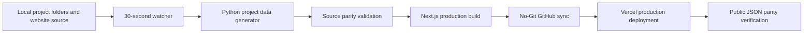

# Vercel Deployment Guide

## Recommended Free Architecture



## What Is Free

- Next.js source code: free
- GitHub repository sync: free
- Vercel free plan hosting: free for normal personal/project use
- Static project dashboard pages: free

## What Is Not Live On Vercel

Vercel cannot read your local Windows folder directly:

```text
C:\Users\pc\OneDrive\Documents\Project Intelligence Hub\projects
```

The local generator converts the project folder data into website files, then GitHub sync sends them to the repository.

## Commands

Run the complete validated publish pipeline once:

```powershell
cd "D:\Project Intelligence Hub NextJS"
cmd /c RUN_FULL_PROJECT_NO_GIT_SYNC.bat Once 30
```

Run the background watcher. It checks project folders and website source every 30 seconds:

```powershell
cd "D:\Project Intelligence Hub NextJS"
cmd /c RUN_FULL_PROJECT_NO_GIT_SYNC.bat Watch 30
```

Run a complete end-to-end pipeline test, including a temporary new-file detection test and public Vercel data comparison:

```powershell
cd "D:\Project Intelligence Hub NextJS"
cmd /c RUN_VERCEL_PIPELINE_TEST.bat
```

The pipeline log is written to `12-logs/vercel_project_pipeline.log`. The latest source and deployed-data audit is written to `12-logs/vercel_streamlit_pipeline_audit_latest.md`.

Run locally:

```powershell
cd "D:\Project Intelligence Hub NextJS\website"
npm install
npm run dev
```

## Vercel Settings

| Setting | Value |
| --- | --- |
| Framework | Next.js |
| Root Directory | `website` |
| Build Command | `npm run build` |
| Install Command | `npm install` |
| Output Directory | `.next` |

## Update Cycle

1. Update any file under a project folder or tracked Next.js source folder.
2. The watcher detects it on the next 30-second poll.
3. It regenerates the website JSON, validates the project-scoped source totals, and runs a production build.
4. Only a successful build is published through the GitHub API sync and deployed to Vercel.
5. The pipeline fetches the public deployment with cache-busting and verifies its JSON against the locally generated project data.

Vercel cannot read the local Windows project folders directly. The practical update time is the 30-second detection interval plus the GitHub/Vercel build and propagation time. A validation or build failure stops the publish/deploy stage and is logged; the watcher retries on the next interval after the issue is corrected.
