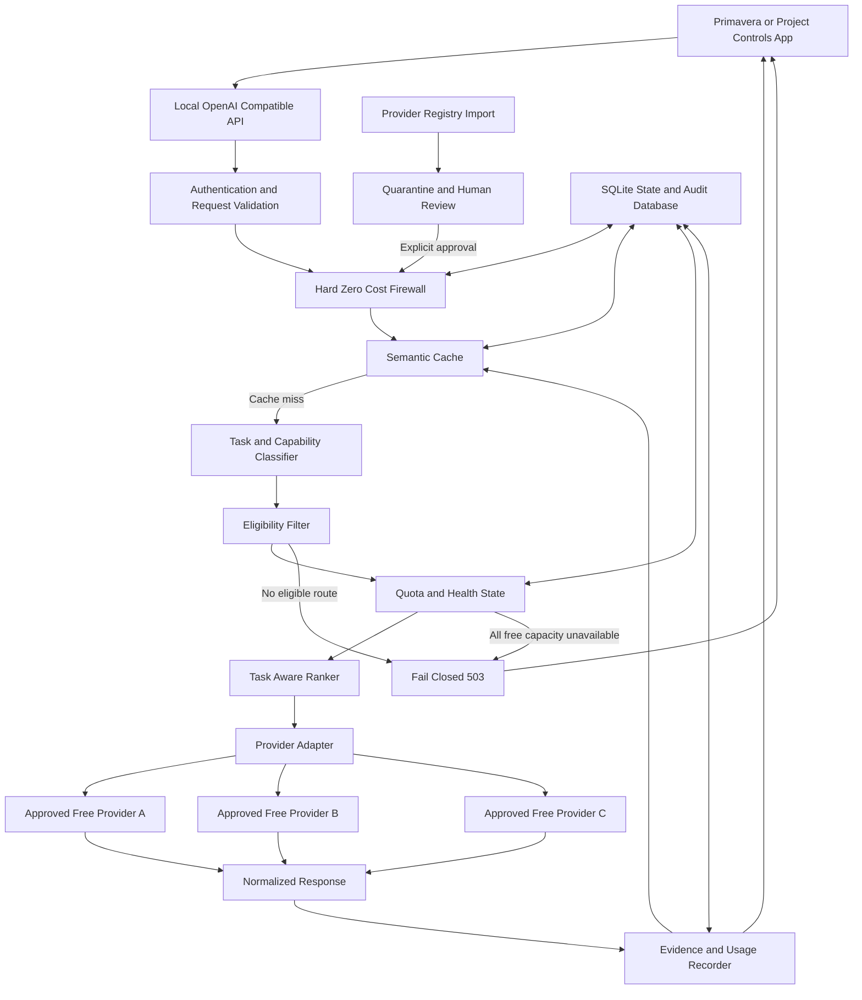
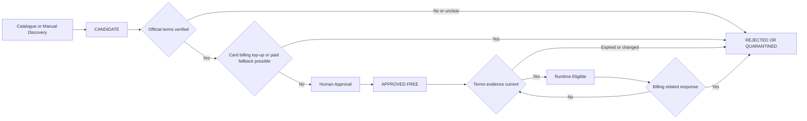
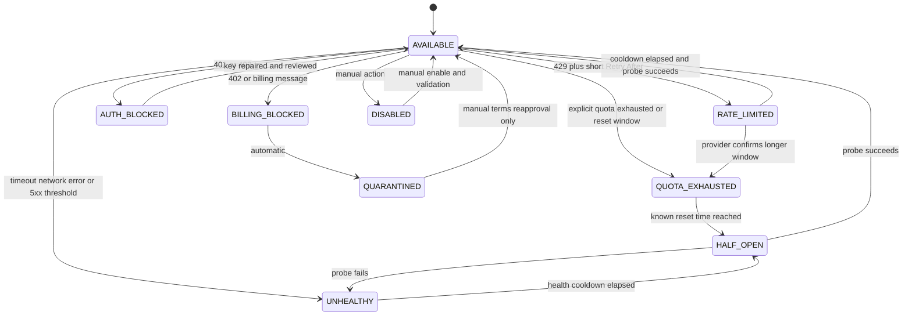
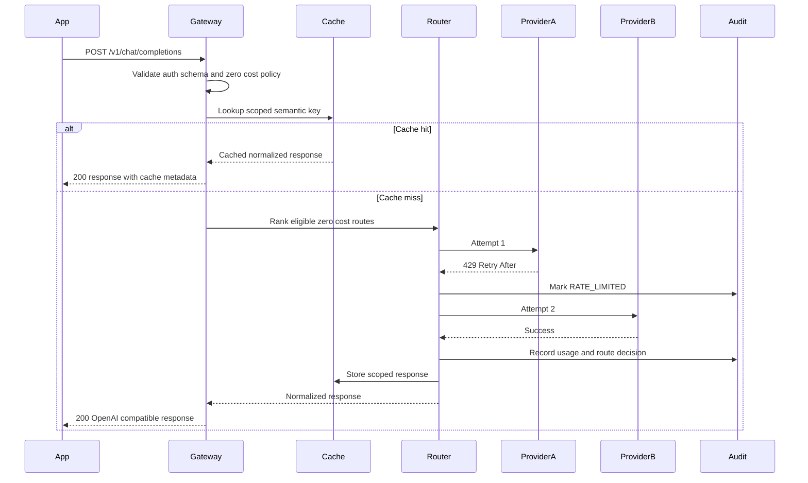
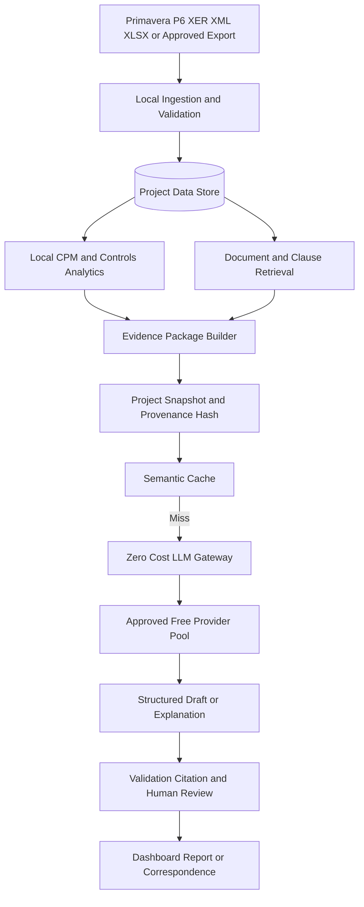

# Zero Monetary Cost Multi Provider LLM Gateway Engineering Specification

**Purpose:** Define a local, OpenAI-compatible gateway that can use multiple hosted LLM free tiers while making monetary spend technically impossible under the configured operating policy.

**Primary integration:** Primavera and project-controls applications

**Reference implementation stack:** Python, FastAPI, SQLite, provider-specific HTTP adapters

**Specification date:** 15 September 2026

**Policy status:** Hard fail-closed at USD 0.00

## Executive summary

The gateway presents one local API to the application and routes each request only to providers and models that have been explicitly approved for zero-monetary-cost use. It tracks short-term rate limits, longer quota windows, provider health, and local usage; rotates automatically when a provider is unavailable; and stops when no approved free capacity remains.

The system never purchases credits, never accepts or requires a credit card, never enables automatic top-up, never uses a paid model, and never falls back to a billable endpoint. A provider or model with unknown, ambiguous, expired, or changed commercial terms is treated as ineligible until a human re-verifies and approves it.

Zero monetary cost is not unlimited usage. Hosted providers can impose requests-per-minute limits, token limits, daily allocations, regional restrictions, model removals, account restrictions, or policy changes. The gateway increases useful availability by caching, reducing prompts, and rotating among approved free providers, but it cannot create unlimited hosted compute. If all eligible capacity is exhausted, the correct result is a controlled `503 free_capacity_exhausted` response with the earliest known reset time.

## Contents

1. [Non negotiable zero cost policy](#1-non-negotiable-zero-cost-policy)
2. [Goals and boundaries](#2-goals-and-boundaries)
3. [System architecture](#3-system-architecture)
4. [Provider registry and approval workflow](#4-provider-registry-and-approval-workflow)
5. [Configuration model](#5-configuration-model)
6. [Hard zero cost firewall](#6-hard-zero-cost-firewall)
7. [Provider adapters](#7-provider-adapters)
8. [Task aware routing](#8-task-aware-routing)
9. [Quota and rate limit state machine](#9-quota-and-rate-limit-state-machine)
10. [Automatic failover and rotation](#10-automatic-failover-and-rotation)
11. [Fail closed behavior and API errors](#11-fail-closed-behavior-and-api-errors)
12. [Semantic cache](#12-semantic-cache)
13. [SQLite state and usage tracking](#13-sqlite-state-and-usage-tracking)
14. [FastAPI OpenAI compatible local gateway](#14-fastapi-openai-compatible-local-gateway)
15. [Security and key handling](#15-security-and-key-handling)
16. [Observability and audit](#16-observability-and-audit)
17. [Primavera and project controls integration](#17-primavera-and-project-controls-integration)
18. [Suggested project structure](#18-suggested-project-structure)
19. [Implementation phases](#19-implementation-phases)
20. [Acceptance criteria](#20-acceptance-criteria)
21. [Verification strategy](#21-verification-strategy)
22. [Operational procedures](#22-operational-procedures)
23. [Design decisions and limitations](#23-design-decisions-and-limitations)
24. [Definition of done](#24-definition-of-done)

## 1 Non negotiable zero cost policy

The following rules are requirements, not preferences:

1. **Maximum monetary cost is USD 0.00.** The allowed cost per request, per day, per month, and for the lifetime of the deployment is zero.
2. **No credit card may be entered or attached** to any provider account used by the gateway.
3. **No paid credits may be purchased or accepted** for gateway operation.
4. **Automatic top-up must remain disabled.** The gateway must not call billing, wallet, credit-purchase, or subscription-upgrade APIs.
5. **Paid fallback is forbidden.** A free model becoming unavailable must never cause selection of a paid model, paid provider tier, marketplace route, or metered endpoint.
6. **Unknown means denied.** Missing or stale price and terms evidence makes a provider or model ineligible.
7. **Eligibility is allowlist based.** Merely appearing in an external catalogue does not enable a provider.
8. **Billing-related errors disable the route.** A payment-required, insufficient-credit, billing-activation, or top-up response immediately quarantines that provider/model until manual review.
9. **Exhaustion fails closed.** When no verified free route is available, the request stops and returns an explicit capacity error.
10. **A human must approve commercial terms.** Automated registry refreshes can propose changes but cannot activate a provider, model, or endpoint.

These invariants should exist in configuration validation, routing code, automated tests, deployment checks, and operational procedures. No single environment variable or user request should be able to bypass them.

## 2 Goals and boundaries

### 2.1 Goals

- Expose one stable local API even when the underlying provider changes.
- Enforce a technically verifiable USD 0.00 ceiling.
- Route by task capability, context size, latency, health, and available free quota.
- Distinguish temporary rate limiting from exhausted quota and permanent ineligibility.
- Preserve request and schedule provenance without logging secrets or unnecessarily exposing project data.
- Minimize hosted inference through deterministic local computation and semantic caching.
- Support a Primavera and project-controls application without asking that application to manage provider keys or failover.
- Produce an auditable answer to: which provider handled this request, why was it eligible, what quota state was known, and what evidence supported the answer?

### 2.2 Non goals

- Guaranteeing uninterrupted or unlimited inference.
- Guaranteeing that any third-party free tier remains available.
- Treating a community catalogue as authoritative pricing or contract evidence.
- Using an LLM to calculate CPM dates, total float, longest path, earned value, resource curves, or contractual entitlement when deterministic methods or approved source systems are required.
- Hiding provider failure, quota exhaustion, or evidence limitations from the calling application.
- Providing legal or contractual determinations without authorized human review.

## 3 System architecture



### 3.1 Trust boundaries

| Zone | Trusted for | Not trusted for |
|---|---|---|
| Local application | Authenticated task requests and local project identity | Selecting or overriding paid routes |
| Gateway policy | Eligibility, cost enforcement, routing, fail-closed behavior | Provider claims that have not been verified |
| External catalogue | Discovery candidates, endpoint hints, model metadata | Automatic activation, current pricing authority, security approval |
| Provider API | Returning model output and rate-limit signals | Preserving free terms indefinitely or performing project calculations correctly |
| LLM output | Drafting, classification, explanation, summarization | Deterministic schedule calculations, source truth, legal entitlement |

## 4 Provider registry and approval workflow

The project [open-free-llm-api/awesome-freellm-apis](https://github.com/open-free-llm-api/awesome-freellm-apis) is a useful provider-registry reference. Its README describes a structured directory of providers, endpoints, model identifiers, context windows, rate limits, authentication requirements, and configuration examples. It distinguishes permanent free tiers from renewable-credit arrangements and records whether a card or other registration step is reported.

The repository is an input to discovery, not a control authority. Provider terms, quotas, model availability, endpoints, and regional access can change independently and without notice. Every imported record must therefore enter `CANDIDATE` or `QUARANTINED` state. It can become `APPROVED_FREE` only after direct verification against the provider's current official terms and a human approval record.

The reference currently identifies possible candidates such as Groq, Google Gemini, GitHub Models, Mistral AI, Cloudflare Workers AI, Cohere, Hugging Face, and Cerebras as not requiring a credit card. These are examples for review, not a permanent allowlist. OpenRouter and any route involving a top-up, renewable paid balance, or ambiguous billing condition must remain excluded from a strict no-top-up pool.

### 4.1 Registry lifecycle



### 4.2 Minimum approval evidence

Each approved provider/model record must include:

- Provider and model identifiers.
- Exact API base URL and permitted path prefix.
- Confirmation that no card is attached or required.
- Confirmation that no paid credits or top-up are required.
- Confirmation that automatic top-up is unavailable or disabled.
- Confirmation that the selected model and endpoint are free at the time of review.
- Applicable rate and quota windows, or `unknown` when the provider does not publish them.
- Official terms or pricing URL.
- Reviewer, approval timestamp, evidence hash or archived note, and an expiry date.
- Permitted data classification and region.
- Explicit `enabled: true` only after approval.

Registry records with expired evidence are excluded at runtime even if the last known price was zero.

## 5 Configuration model

Configuration should be declarative, schema-validated at startup, and immutable during a request. Secrets must be referenced by name, never stored in this file.

```yaml
version: 1

policy:
  currency: USD
  maximum_cost_per_request: 0.00
  maximum_cost_per_day: 0.00
  maximum_cost_lifetime: 0.00
  allow_credit_card: false
  allow_paid_credits: false
  allow_automatic_topup: false
  allow_paid_fallback: false
  allow_unknown_pricing: false
  allow_expired_terms_evidence: false
  fail_closed: true
  maximum_failover_attempts: 3
  registry_refresh_can_auto_enable: false
  terms_review_max_age_days: 30

gateway:
  bind_host: 127.0.0.1
  port: 8000
  database_url: sqlite:///./data/gateway.db
  request_timeout_seconds: 60
  local_api_key_env: ZERO_COST_GATEWAY_API_KEY
  log_prompt_content: false
  log_response_content: false

cache:
  enabled: true
  backend: sqlite
  semantic_threshold: 0.94
  default_ttl_seconds: 86400
  require_same_project_snapshot: true
  bypass_for_tasks:
    - contractual_conclusion
    - current_provider_terms
    - live_schedule_status

providers:
  example_provider_a:
    enabled: true
    approval_state: APPROVED_FREE
    base_url: https://api.example.invalid/openai/v1
    secret_env: EXAMPLE_PROVIDER_A_API_KEY
    billing_instrument_present: false
    paid_credits_present: false
    automatic_topup_enabled: false
    terms:
      price_verified_zero: true
      verified_at: 2026-09-15T00:00:00Z
      expires_at: 2026-10-15T00:00:00Z
      official_url: https://provider.example.invalid/pricing
      evidence_sha256: replace-with-review-evidence-hash
    adapter: openai_compatible
    priority: 10
    models:
      - id: example-free-model
        enabled: true
        free_only: true
        capabilities: [text, reasoning, code]
        context_tokens: 131072
        max_output_tokens: 8192
        pricing:
          input_usd_per_million_tokens: 0.00
          output_usd_per_million_tokens: 0.00
        published_limits:
          requests_per_minute: null
          tokens_per_minute: null
          requests_per_day: null

  paid_or_ambiguous_example:
    enabled: false
    approval_state: REJECTED
    rejection_reason: top_up_or_paid_fallback_possible
```

The example hostnames are intentionally non-operational. Production entries must be created only from verified provider evidence.

## 6 Hard zero cost firewall

The cost firewall has two stages.

### 6.1 Startup validation

The gateway must refuse to start if any enabled route violates the policy. Validation must check:

- Provider state equals `APPROVED_FREE`.
- Provider and model are both explicitly enabled.
- Input, output, image, audio, tool, storage, and request prices are known and exactly zero.
- No billing instrument, paid balance, paid subscription, top-up, or paid fallback is configured.
- Terms evidence is present and unexpired.
- Base URL and path match the approved egress allowlist.
- Secret references exist without exposing their values.
- No wildcard model mapping can resolve to an unapproved model.
- No generic aggregator or provider-managed `auto` model can choose a paid route.

### 6.2 Per request enforcement

The firewall repeats eligibility checks immediately before every outbound attempt. It must not trust a route selected earlier in the request if policy or state has changed. The check should return a signed or immutable in-process decision containing the provider, model, policy version, terms-evidence version, and zero-cost proof used for the attempt.

```python
def assert_zero_cost(route, policy, now):
    assert policy.maximum_cost_per_request == Decimal("0.00")
    assert policy.allow_credit_card is False
    assert policy.allow_paid_credits is False
    assert policy.allow_automatic_topup is False
    assert policy.allow_paid_fallback is False

    if not route.provider.enabled or not route.model.enabled:
        raise RouteDenied("route_disabled")
    if route.provider.approval_state != "APPROVED_FREE":
        raise RouteDenied("provider_not_approved")
    if route.terms.expires_at <= now:
        raise RouteDenied("terms_evidence_expired")
    if route.billing_instrument_present or route.paid_credits_present:
        raise RouteDenied("billing_or_paid_credit_present")
    if route.automatic_topup_enabled:
        raise RouteDenied("automatic_topup_enabled")
    if any(price is None or price != Decimal("0") for price in route.all_prices):
        raise RouteDenied("price_not_proven_zero")
    if not egress_allowlist.matches(route.base_url, route.model.id):
        raise RouteDenied("route_not_allowlisted")

    return ZeroCostDecision(
        provider=route.provider.id,
        model=route.model.id,
        policy_version=policy.version,
        terms_evidence_hash=route.terms.evidence_sha256,
    )
```

### 6.3 Billing tripwire

Responses or messages matching billing conditions—including HTTP `402`, insufficient balance, credit required, add payment method, trial ended, upgrade required, or top-up required—must:

1. Stop retrying that provider and model.
2. Transition the route to `BILLING_BLOCKED`.
3. Record a redacted high-severity audit event.
4. Exclude the route from all future requests.
5. Require manual terms review before reactivation.

The gateway may continue only with another independently approved zero-cost route. It must never attempt to solve a billing response by purchasing credits, changing plan, enabling a card, or selecting a priced model.

## 7 Provider adapters

Adapters isolate provider differences behind one internal interface. OpenAI-compatible providers can share a base adapter, while Gemini-like or other schemas use dedicated adapters.

```python
class ProviderAdapter(Protocol):
    async def generate(self, request: NormalizedRequest) -> NormalizedResponse: ...
    async def health(self) -> HealthResult: ...
    def classify_error(self, response_or_exception) -> ProviderError: ...
    def parse_limits(self, headers: Mapping[str, str]) -> LimitUpdate: ...
    def estimate_tokens(self, request: NormalizedRequest) -> TokenEstimate: ...
```

Each adapter must normalize:

- Chat messages, system instructions, temperature, output limit, tools, and streaming.
- Provider-specific model IDs.
- Token or usage reporting.
- Retry-after and rate-limit headers.
- Safety, authentication, context-length, quota, billing, timeout, and server errors.
- Finish reasons and tool-call structures.

Adapters must not contain routing policy or silently substitute models. If a requested feature is unsupported, the adapter returns `CAPABILITY_UNSUPPORTED`; the router decides whether another approved route may be tried.

## 8 Task aware routing

Simple round-robin rotation wastes quota and can send tasks to incapable models. The router should classify each request into a controlled task profile and select only compatible routes.

| Task profile | Required capability | Project controls example | Preferred local preprocessing |
|---|---|---|---|
| `classification_small` | Fast text classification | Classify activity narrative or document type | Rules, lookup tables, deduplication |
| `schedule_explanation` | Reasoning and structured output | Explain float movement from computed evidence | XER parse, calendar normalization, CPM results |
| `document_extraction` | Long context or chunked extraction | Extract dates, notices, parties, and obligations | OCR, text extraction, page indexing |
| `contract_draft` | Strong drafting with citations | Draft a notice using approved evidence | Clause retrieval and provenance filtering |
| `code_generation` | Code capability | Generate a local schedule-processing function | Static context selection and tests |
| `report_narrative` | Structured long-form output | Build a monthly progress narrative | KPI calculation and table preparation |

### 8.1 Eligibility before ranking

The router first removes any route that is:

- Not approved by the zero-cost firewall.
- In cooldown, quota-exhausted, unhealthy, disabled, or billing-blocked state.
- Missing required context length, modality, structured-output, tool, or data-region capability.
- Unable to accept the estimated prompt and output tokens with a safety margin.
- Disallowed for the request's data classification.

Only then does it rank candidates. A possible score is:

```text
score =
    capability_quality
  + task_preference
  + quota_headroom
  + recent_success_rate
  - latency_penalty
  - recent_failure_penalty
  - provider_concentration_penalty
```

Cost is never a ranking weight because every admitted route must already be proven to cost exactly zero. A non-zero or unknown-cost route cannot become eligible by receiving a favorable score.

## 9 Quota and rate limit state machine

The gateway must distinguish a short burst limit from a daily or monthly allocation. A single HTTP `429` is not sufficient evidence of daily exhaustion.



### 9.1 State interpretation

| State | Meaning | Router action |
|---|---|---|
| `AVAILABLE` | Approved route has known or assumed remaining capacity | Eligible |
| `RATE_LIMITED` | Short-term RPM or TPM window exceeded | Skip until `retry_after` |
| `QUOTA_EXHAUSTED` | Daily, weekly, monthly, or trial-free allocation exhausted | Skip until verified reset |
| `UNHEALTHY` | Repeated timeout, connection, or 5xx failure | Skip during exponential cooldown |
| `HALF_OPEN` | One controlled probe is allowed | Normal traffic remains blocked |
| `AUTH_BLOCKED` | Key invalid, revoked, or forbidden | Skip and alert operator |
| `BILLING_BLOCKED` | Provider requests payment, balance, card, upgrade, or top-up | Immediately quarantine |
| `QUARANTINED` | Human review required | Never route |
| `DISABLED` | Administratively disabled | Never route |

When response headers are absent or contradictory, the conservative interpretation wins. An unknown reset time must not trigger rapid retries.

## 10 Automatic failover and rotation

Failover is bounded, capability-preserving, and idempotency-aware.



Failover rules:

- Retry only errors classified as rate limit, quota, timeout, connection, or transient 5xx.
- Do not retry invalid requests, content-policy refusals, unsupported capabilities, or context overflow without an explicit transformation strategy.
- Never retry a billing-related route; quarantine it.
- Do not downgrade required capabilities or evidence constraints merely to obtain an answer.
- Apply a maximum attempt count and total request deadline.
- Prefer a different provider for the next attempt to avoid correlated model or account limits.
- Preserve one request ID and record every attempt under it.
- For tool-calling or side-effecting workflows, require idempotency keys and do not repeat external actions.

```python
async def route_request(request, context):
    cached = cache.lookup(request, context)
    if cached:
        return cached.with_metadata(cache_hit=True)

    candidates = rank_routes(
        routes=registry.snapshot(),
        task=classify_task(request),
        required_capabilities=infer_requirements(request),
        quota_state=quota_store.snapshot(),
    )

    attempts = []
    for route in candidates[: policy.maximum_failover_attempts]:
        decision = assert_zero_cost(route, policy, clock.now())
        try:
            response = await adapters[route.adapter].generate(
                normalize_request(request, route)
            )
            usage_store.record_success(request, route, response, decision)
            cache.store(request, context, response)
            return response
        except ProviderException as exc:
            error = adapters[route.adapter].classify_error(exc)
            attempts.append(record_attempt(route, error))
            state_machine.apply(route, error)
            if error.kind in {"BILLING", "INVALID_REQUEST", "SAFETY_REFUSAL"}:
                if error.kind == "BILLING":
                    registry.quarantine(route, reason="billing_tripwire")
                if error.kind != "BILLING":
                    break

    raise FreeCapacityExhausted(
        attempts=attempts,
        earliest_reset=quota_store.earliest_known_reset(candidates),
    )
```

## 11 Fail closed behavior and API errors

The gateway must return stable machine-readable errors. It must not disguise exhaustion as a generic model failure.

```json
{
  "error": {
    "message": "Free inference capacity is temporarily unavailable. No paid fallback was attempted.",
    "type": "free_capacity_exhausted",
    "code": "free_capacity_exhausted",
    "request_id": "req_01J...",
    "earliest_known_reset_at": "2026-09-15T14:30:00Z",
    "retryable": true
  }
}
```

Recommended status mapping:

| HTTP | Code | Meaning |
|---:|---|---|
| 400 | `invalid_request` | Client request cannot be normalized safely |
| 401 | `gateway_authentication_failed` | Local gateway credential rejected |
| 403 | `policy_denied` | Data, capability, or route violates policy |
| 409 | `project_snapshot_mismatch` | Request evidence and selected project revision differ |
| 429 | `gateway_rate_limited` | Local client limit exceeded |
| 503 | `free_capacity_exhausted` | No approved free route currently available |
| 503 | `no_zero_cost_route` | No provider/model passes the hard firewall |
| 503 | `provider_terms_review_required` | All otherwise capable routes have stale or ambiguous terms |

## 12 Semantic cache

The semantic cache reduces repeated hosted calls while preserving project and evidence boundaries.

### 12.1 Cache key and scope

An exact cache key should include:

- Canonical messages and tool definitions.
- Task profile and response schema.
- Gateway policy version.
- Application, tenant, project, and user scope as required.
- Primavera source-file hash or schedule snapshot ID.
- Data date, selected baseline, calendar version, and analysis configuration.
- Retrieval evidence IDs and hashes.
- Model capability class rather than provider name when responses are safely interchangeable.

Semantic matching can be applied after exact matching, but only within the same authorized scope and compatible evidence snapshot. The system must not reuse an answer from another project, another contract, an older schedule update, or a different access-control scope.

### 12.2 Cache safety

- Cache deterministic extraction and explanatory answers more aggressively than current-status or contractual conclusions.
- Bypass or shorten the TTL for time-sensitive provider terms, live schedule status, claims positions, and safety-sensitive answers.
- Encrypt sensitive cached content at rest when project policy requires it.
- Store provenance with every entry so a cached answer remains traceable.
- Mark cache hits in response metadata.
- Invalidate by project snapshot, evidence hash, prompt template version, and policy version.
- Do not use an external paid embedding API for cache similarity. Use a local embedding model or exact/hash-based matching.

```python
def cache_identity(request, project_context):
    material = {
        "messages": canonicalize(request.messages),
        "tools": canonicalize(request.tools),
        "task": request.task_profile,
        "response_schema": request.response_schema,
        "policy_version": POLICY_VERSION,
        "tenant_id": project_context.tenant_id,
        "project_id": project_context.project_id,
        "schedule_snapshot": project_context.schedule_sha256,
        "data_date": project_context.data_date,
        "evidence_hashes": sorted(project_context.evidence_hashes),
        "prompt_template_version": request.prompt_template_version,
    }
    return sha256(canonical_json(material)).hexdigest()
```

## 13 SQLite state and usage tracking

SQLite is adequate for a single-node local gateway. Enable WAL mode, foreign keys, bounded retention, and periodic backups. Move to a server database only if multiple gateway processes must write concurrently.

### 13.1 Core tables

| Table | Purpose |
|---|---|
| `providers` | Approval, endpoint, terms, security, and administrative state |
| `models` | Capability, context, zero-price evidence, and provider mapping |
| `quota_windows` | Known RPM, TPM, daily, weekly, and monthly limits and resets |
| `route_state` | Current availability, cooldown, health, and failure counters |
| `requests` | One record per local request with project and task metadata |
| `attempts` | One record per provider attempt and routing decision |
| `usage_events` | Reported or estimated input/output tokens and request counts |
| `cache_entries` | Scoped exact or semantic cache metadata and encrypted payload reference |
| `policy_events` | Startup validation, denials, quarantines, approvals, and policy changes |
| `terms_evidence` | Source URL, review date, expiry, reviewer, and evidence hash |

### 13.2 Illustrative schema

```sql
CREATE TABLE requests (
    request_id TEXT PRIMARY KEY,
    created_at TEXT NOT NULL,
    completed_at TEXT,
    client_id TEXT NOT NULL,
    project_id TEXT,
    project_snapshot_hash TEXT,
    task_profile TEXT NOT NULL,
    status TEXT NOT NULL,
    cache_hit INTEGER NOT NULL DEFAULT 0,
    error_code TEXT
);

CREATE TABLE attempts (
    attempt_id INTEGER PRIMARY KEY AUTOINCREMENT,
    request_id TEXT NOT NULL REFERENCES requests(request_id),
    attempt_number INTEGER NOT NULL,
    provider_id TEXT NOT NULL,
    model_id TEXT NOT NULL,
    zero_cost_decision_hash TEXT NOT NULL,
    started_at TEXT NOT NULL,
    completed_at TEXT,
    outcome TEXT NOT NULL,
    http_status INTEGER,
    normalized_error TEXT,
    retry_after_at TEXT
);

CREATE TABLE usage_events (
    usage_id INTEGER PRIMARY KEY AUTOINCREMENT,
    attempt_id INTEGER NOT NULL REFERENCES attempts(attempt_id),
    observed_at TEXT NOT NULL,
    input_tokens INTEGER,
    output_tokens INTEGER,
    request_units REAL,
    usage_source TEXT NOT NULL CHECK (usage_source IN ('provider','estimated')),
    monetary_cost_usd TEXT NOT NULL CHECK (monetary_cost_usd = '0.00')
);

CREATE TABLE route_state (
    provider_id TEXT NOT NULL,
    model_id TEXT NOT NULL,
    state TEXT NOT NULL,
    reason TEXT,
    retry_after_at TEXT,
    consecutive_failures INTEGER NOT NULL DEFAULT 0,
    last_success_at TEXT,
    last_failure_at TEXT,
    updated_at TEXT NOT NULL,
    PRIMARY KEY (provider_id, model_id)
);
```

The database `CHECK` constraint is a defense in depth measure, not the only cost control. Because providers may change terms without changing the API response, external terms evidence and manual approval remain necessary.

## 14 FastAPI OpenAI compatible local gateway

The local service should support the smallest OpenAI-compatible surface needed by existing clients:

- `POST /v1/chat/completions`
- `GET /v1/models` returning only currently eligible virtual models
- `GET /healthz` for process health
- `GET /readyz` for policy, database, and registry readiness
- `GET /v1/gateway/capacity` for redacted free-capacity status
- Restricted local administration endpoints for approval and quarantine workflows, preferably unavailable on the public listener

Clients should request virtual model names such as `zero-cost-auto`, `zero-cost-reasoning`, or `zero-cost-long-context`. The gateway maps the virtual capability to an approved provider model. Clients must not be able to inject a raw provider URL or arbitrary provider model ID.

```python
from fastapi import Depends, FastAPI, Request

app = FastAPI(title="Zero Cost LLM Gateway")

@app.on_event("startup")
async def startup():
    config = load_and_validate_config()
    validate_database_constraints()
    validate_every_enabled_route_is_proven_zero_cost(config)
    freeze_policy_snapshot(config.policy)

@app.post("/v1/chat/completions")
async def chat_completions(
    request: Request,
    client=Depends(authenticate_local_client),
):
    payload = await parse_openai_compatible_request(request)
    normalized = validate_and_normalize(payload, client)
    project_context = resolve_project_context(normalized, client)
    response = await router.route(normalized, project_context)
    return to_openai_compatible_response(response)

@app.get("/v1/models")
async def list_models(client=Depends(authenticate_local_client)):
    return virtual_models_visible_to(client)
```

Example client configuration:

```python
from openai import OpenAI

client = OpenAI(
    base_url="http://127.0.0.1:8000/v1",
    api_key="local-gateway-key-from-secret-store",
)

response = client.chat.completions.create(
    model="zero-cost-auto",
    messages=[
        {"role": "system", "content": "Use only supplied project evidence."},
        {"role": "user", "content": "Explain the critical-path change."},
    ],
)
```

Binding to `127.0.0.1` is the safest default. If LAN access is required, use TLS, client authentication, host firewall rules, and explicit network authorization.

## 15 Security and key handling

### 15.1 Secret controls

- Store provider keys in an operating-system secret store or a secrets manager approved for the deployment.
- Environment variables may contain runtime references, but `.env` files containing real keys must not be committed, packaged, cached, or copied into support bundles.
- Use a distinct key per provider and environment; never reuse the local gateway API key as a provider key.
- Restrict key permissions to the gateway process identity.
- Redact authorization headers, cookies, query tokens, request bodies, and provider responses from logs by default.
- Rotate a key immediately after suspected exposure and mark the route `AUTH_BLOCKED` until validation succeeds.
- Never send provider keys to the Primavera client, browser, or report output.

### 15.2 Network and application controls

- Maintain an exact HTTPS egress allowlist of approved provider hosts and path prefixes.
- Reject redirects to unapproved hosts to prevent policy bypass and secret leakage.
- Validate TLS certificates and do not disable certificate verification.
- Reject client-supplied base URLs, proxy settings, provider headers, and model overrides.
- Enforce local client authentication, per-client quotas, body-size limits, timeouts, and concurrency limits.
- Use structured schema validation to reduce prompt and tool injection into control fields.
- Keep administrative approval endpoints on a separate local interface or offline command path.
- Sign or hash policy and terms snapshots recorded with each attempt.
- Apply data-classification rules before sending schedule, contract, personal, or commercially sensitive content to a provider.
- Minimize outbound data: send only the evidence fragments needed for the task.

## 16 Observability and audit

Observability must prove the gateway's behavior without exposing prompts, documents, keys, or personal data.

### 16.1 Metrics

Recommended metrics include:

- Requests by task profile, outcome, and cache-hit status.
- Provider attempts, success rate, latency, normalized error, and failover count.
- Estimated and provider-reported input/output tokens.
- Rate-limit and quota state by route.
- Earliest known free-capacity reset.
- Routes excluded by zero-cost policy and reason.
- Billing-tripwire activations and quarantines.
- Terms evidence approaching expiry.
- Number of eligible routes per virtual model.
- A hard monetary-cost metric that must remain exactly `0.00`.

Do not place provider IDs, project IDs, prompt fragments, filenames, or user identities in high-cardinality metric labels. Put sensitive correlation data in protected audit records.

### 16.2 Audit event example

```json
{
  "event": "route_attempt_completed",
  "request_id": "req_01J...",
  "provider_id": "provider_a",
  "model_id": "approved_free_model",
  "task_profile": "schedule_explanation",
  "zero_cost_decision_hash": "sha256:...",
  "terms_evidence_hash": "sha256:...",
  "outcome": "rate_limited",
  "next_state": "RATE_LIMITED",
  "retry_after_at": "2026-09-15T14:30:00Z",
  "input_tokens": 4812,
  "output_tokens": 0,
  "monetary_cost_usd": "0.00",
  "prompt_logged": false,
  "response_logged": false
}
```

Operators should receive an alert when a billing tripwire fires, a terms review expires, all routes for a required capability are unavailable, the database cost invariant is violated, or the eligible-route count unexpectedly drops to zero.

## 17 Primavera and project controls integration

The project-controls application should compute factual schedule and cost results locally, then ask the LLM to interpret a compact, traceable evidence package. This preserves accuracy and dramatically reduces free-tier consumption.



### 17.1 Local deterministic responsibilities

Perform these locally using validated code and approved source data:

- XER parsing and field normalization.
- WBS, activity, relationship, constraint, calendar, resource, and code extraction.
- CPM calculations, float analysis, longest-path logic, progress checks, and schedule comparison.
- Earned-value, resource, quantity, cost, and variance calculations.
- Data-date checks, baseline/current-update selection, and missing-data detection.
- Document OCR, clause indexing, evidence dating, and duplicate detection.
- Tables, charts, and numeric reconciliation.

Native Primavera P6 recalculation and professional schedule review remain necessary before execution or contractual reliance. The gateway does not convert an LLM narrative into an approved schedule or contractual fact.

### 17.2 LLM responsibilities

Use the gateway for bounded tasks such as:

- Explain a locally computed variance in plain language.
- Summarize retrieved evidence while retaining citations.
- Classify correspondence and activity narratives.
- Draft report sections from verified metrics.
- Generate questions about missing or inconsistent data.
- Convert structured results into stakeholder-specific language.

The prompt must tell the model to abstain when evidence is insufficient and to cite supplied evidence IDs. A response without required citations or schema fields should fail validation rather than be published.

### 17.3 Evidence package example

```yaml
project_context:
  project_id: PRJ-001
  schedule_snapshot_sha256: 7a6f...redacted
  data_date: 2026-09-15
  baseline_id: BL-APPROVED-01
  source_system: Primavera P6 export

task:
  profile: schedule_explanation
  question: Explain the change in the driving path without recalculating dates.
  output_schema: schedule_explanation_v1

computed_facts:
  - fact_id: F-001
    name: forecast_finish_variance_days
    value: 12
    method: local_schedule_comparison
  - fact_id: F-002
    name: current_driving_activity
    value: ACT-2450
    method: local_longest_path_result

evidence:
  - evidence_id: E-101
    type: activity_record
    activity_id: ACT-2450
    source_hash: sha256:...
  - evidence_id: E-102
    type: relationship_change
    source_hash: sha256:...

instructions:
  - Use only computed_facts and evidence.
  - Do not calculate CPM dates or float.
  - Cite fact and evidence IDs for every conclusion.
  - Return HOLD when evidence is insufficient.
```

## 18 Suggested project structure

```text
zero-cost-llm-gateway/
├── app/
│   ├── api/                 # FastAPI routes and schemas
│   ├── policy/              # Cost firewall and configuration validation
│   ├── registry/            # Candidate import review and approved snapshots
│   ├── adapters/            # Provider protocol and implementations
│   ├── routing/             # Task classification ranking and failover
│   ├── quota/               # Limit parsing state machine and cooldowns
│   ├── cache/                # Exact and semantic cache
│   ├── storage/             # SQLite models migrations and repositories
│   ├── security/            # Auth redaction egress and secret interfaces
│   ├── observability/       # Metrics logs audit and alerts
│   └── primavera/           # Context and evidence integration interfaces
├── config/
│   ├── policy.yaml
│   ├── providers.approved.yaml
│   └── task-profiles.yaml
├── migrations/
├── tests/
│   ├── unit/
│   ├── integration/
│   ├── contract/
│   └── failure_injection/
├── data/                    # Runtime state excluded from source control
└── docs/
```

## 19 Implementation phases

### Phase 0 Policy and threat model

- Convert the non-negotiable rules into a versioned policy schema.
- Define data classes, approved network destinations, and operator roles.
- Define the terms-review evidence process and expiry period.
- Create tests that prove invalid or ambiguous configurations cannot start.

**Exit condition:** A policy fixture with any price above zero, unknown pricing, card, paid credit, top-up, expired evidence, or paid fallback is rejected.

### Phase 1 Single provider vertical slice

- Build FastAPI request validation and local client authentication.
- Implement one adapter against a manually approved free route.
- Create normalized request, response, usage, and error types.
- Add SQLite migrations and request/attempt records.

**Exit condition:** An OpenAI SDK client can call the local endpoint, and every attempt records a zero-cost decision.

### Phase 2 Registry and cost firewall

- Implement candidate import from the reference catalogue.
- Quarantine all imported records by default.
- Add human approval, evidence expiry, and immutable approved snapshots.
- Add startup and per-attempt firewall checks.

**Exit condition:** No imported provider becomes routable without direct terms verification and explicit approval.

### Phase 3 Multiple adapters and failover

- Add at least two independently approved providers.
- Implement error classification, bounded retries, health cooldown, and route quarantine.
- Add request IDs, attempt histories, and stable capacity errors.

**Exit condition:** Simulated `429`, timeout, and `5xx` responses rotate correctly; simulated billing responses quarantine the route; all-route exhaustion returns `503` without network calls to any paid endpoint.

### Phase 4 Quota engine and task routing

- Parse standard and provider-specific limit headers.
- Track RPM, TPM, daily, and longer windows separately.
- Add capability filters and task profiles.
- Add route scoring with quota headroom and health.

**Exit condition:** A route is never selected when it lacks capacity or required capability, and a short rate limit is not mistaken for daily exhaustion.

### Phase 5 Semantic cache and context reduction

- Add exact cache keys and project-snapshot invalidation.
- Add local embeddings only if semantic matching is justified.
- Add privacy scopes, TTLs, and task-specific bypass rules.
- Measure provider-call reduction without cross-project leakage.

**Exit condition:** Repeated equivalent requests for the same evidence snapshot use the cache; changed schedule or contract evidence invalidates the result.

### Phase 6 Primavera integration

- Connect the existing XER or schedule-data pipeline.
- Build compact evidence packages with IDs and hashes.
- Add structured response validation and `HOLD` behavior.
- Surface provider, cache, snapshot, and evidence provenance in the application.

**Exit condition:** Schedule calculations originate locally, LLM narratives cite supplied evidence, and unsupported conclusions are blocked.

### Phase 7 Operations and hardening

- Add dashboards, alerts, encrypted backups, retention, key rotation, and recovery procedures.
- Run failure injection for quota, billing, DNS, TLS, malformed responses, stale terms, and database locking.
- Document provider onboarding and emergency disable procedures.

**Exit condition:** Operators can demonstrate fail-closed behavior and prove that no paid route, billing instrument, or automatic top-up exists.

## 20 Acceptance criteria

| ID | Given | When | Then |
|---|---|---|---|
| AC-01 | An enabled model has a non-zero price | Gateway starts | Startup fails with `price_not_proven_zero` |
| AC-02 | An enabled model has unknown pricing | Gateway starts | Startup fails; unknown is never treated as free |
| AC-03 | A provider account has a card, paid credits, or top-up enabled | Configuration is validated | Provider is rejected |
| AC-04 | A registry import contains a new free-looking provider | Import completes | Route remains quarantined until human approval |
| AC-05 | Terms evidence is expired | A request is routed | Route is excluded and review is requested |
| AC-06 | Preferred provider returns short-window `429` | Another eligible provider exists | State becomes `RATE_LIMITED` and request rotates |
| AC-07 | Provider confirms daily quota exhaustion | Request is routed | State becomes `QUOTA_EXHAUSTED` until reset |
| AC-08 | Provider returns `402` or a top-up message | Error is classified | Route is billing-blocked and quarantined immediately |
| AC-09 | All approved free capacity is unavailable | Client sends a request | Gateway returns `503 free_capacity_exhausted` and makes no paid call |
| AC-10 | A client supplies an arbitrary base URL or raw unapproved model | Request is validated | Request is rejected before outbound network access |
| AC-11 | Two equivalent requests use the same project snapshot | Second request arrives within TTL | Scoped cache returns the response without a provider call |
| AC-12 | Schedule snapshot or evidence hash changes | Similar request arrives | Previous cache entry is not reused |
| AC-13 | Request asks the LLM to recompute CPM | Primavera workflow validates task | Deterministic local result is used or request is rejected |
| AC-14 | Evidence is insufficient for a required conclusion | Structured answer is validated | Result is `HOLD`, not an invented conclusion |
| AC-15 | Audit logs are inspected | Requests have completed | Route decisions and zero-cost evidence are traceable; keys and prompt bodies are absent |
| AC-16 | Network egress is monitored during failure tests | Free routes fail | No traffic reaches unapproved or paid endpoints |
| AC-17 | Usage records are queried | Any completed attempt exists | `monetary_cost_usd` is exactly `0.00` |
| AC-18 | One provider is unavailable | Other capable free routes exist | Client receives a normalized response without provider-specific changes |
| AC-19 | No route supports a required capability | Request is routed | Gateway fails closed and does not downgrade silently |
| AC-20 | Gateway is bound to local mode | Remote host connects | Connection is denied |

## 21 Verification strategy

The release test suite should include:

- **Policy mutation tests:** Programmatically change each cost-related field and prove startup or routing rejection.
- **Adapter contract tests:** Replay provider success and error fixtures without using live paid services.
- **Failure injection:** Simulate `401`, `402`, `403`, `408`, `429`, `5xx`, timeouts, DNS failure, TLS failure, malformed JSON, missing headers, and contradictory limits.
- **Network-deny tests:** Run with only approved provider hosts allowed and confirm arbitrary URL injection cannot create egress.
- **Quota-clock tests:** Use a fake clock to test RPM, TPM, daily reset, unknown reset, cooldown, and half-open behavior.
- **Cache-isolation tests:** Prove that project, tenant, schedule snapshot, evidence, and access changes prevent unsafe reuse.
- **Concurrency tests:** Verify atomic quota reservations and SQLite behavior under parallel requests.
- **Primavera evidence tests:** Confirm that all narrative facts map to locally computed facts or source evidence IDs.
- **Secret-scanning tests:** Inspect source, configuration, logs, database exports, and support bundles for provider keys.
- **End-to-end fail-closed test:** Exhaust or disable every approved free route and verify a `503`, zero paid calls, zero billing actions, and zero monetary cost.

Live tests should use only accounts already approved under this policy and should remain within published free limits. No acceptance test may require entering a card, purchasing a balance, activating billing, or enabling automatic top-up.

## 22 Operational procedures

### 22.1 Provider onboarding

1. Import or create a candidate record in quarantine.
2. Review the provider's official pricing, free-tier, data-use, retention, and regional terms.
3. Create an account without entering a card and without purchasing credits.
4. Confirm automatic top-up and paid fallback are absent or disabled.
5. Restrict the provider key and test only the intended free model and endpoint.
6. Record evidence, reviewer, hash, and expiry.
7. Enable the route in a signed configuration change.
8. Run policy, adapter, network, and billing-tripwire tests.

### 22.2 Provider removal

Immediately disable and quarantine a provider if:

- Free terms become ambiguous or paid.
- A card, payment method, subscription, paid credit, or top-up becomes required.
- The API redirects or resolves to an unapproved service.
- Data handling no longer satisfies project policy.
- Authentication or account behavior cannot be explained.
- Billing-related responses occur.

### 22.3 Capacity exhaustion message

The user-facing application should say:

> Free inference capacity is temporarily exhausted. No paid service was used or attempted. Retry after the displayed reset time, use a cached/local analysis, or continue without AI-generated narrative.

The application should preserve deterministic schedule dashboards and calculations during LLM outages. AI narrative generation is an optional enhancement, not a dependency for viewing core project-control facts.

## 23 Design decisions and limitations

- **Availability is best effort.** Multiple providers reduce single-provider disruption but do not guarantee service.
- **Free terms are external state.** The registry review process reduces risk but cannot prevent a provider from changing terms between reviews.
- **Zero cost is enforced conservatively.** A route may be blocked even if it is still free when evidence is stale or incomplete. This is intentional.
- **Usage accounting is not billing authority.** Local token counts help manage quotas, but the absence of reported cost cannot prove that a route is free; terms approval is required.
- **Caching trades freshness for capacity.** Snapshot hashes, TTLs, bypass rules, and visible cache metadata control that tradeoff.
- **Provider diversity affects answers.** Structured schemas, evidence requirements, validation, and model-capability profiles reduce variance but cannot eliminate it.
- **Sensitive data requires separate approval.** Zero price does not imply acceptable confidentiality, retention, or jurisdiction.

## 24 Definition of done

The gateway is ready for controlled use only when all of the following are true:

- The hard zero-cost policy is implemented in schema validation and per-attempt enforcement.
- There is no code path, configuration path, or provider setting that can purchase credits, attach a card, enable top-up, or select a paid fallback.
- Every enabled route has current official terms evidence and explicit human approval.
- At least two approved providers pass adapter and failover tests, if operational resilience is required.
- All-route exhaustion has been demonstrated to fail closed.
- Semantic cache isolation and invalidation have passed.
- SQLite audit records reconcile every outbound attempt and always record USD 0.00.
- Secrets are absent from source control, logs, database exports, and user-visible responses.
- Primavera calculations remain local and traceable to an approved schedule snapshot.
- LLM outputs are validated, evidence-linked, and capable of returning `HOLD`.
- Monitoring alerts on billing tripwires, terms expiry, zero eligible routes, and policy failures.
- The operational owner has documented onboarding, disabling, key rotation, backup, and recovery procedures.

The central operating promise is narrow and testable: **one local endpoint may rotate among verified free providers, but it will stop before it spends money.**

## Reference

- [open-free-llm-api/awesome-freellm-apis](https://github.com/open-free-llm-api/awesome-freellm-apis), reviewed 15 September 2026. Use it to discover candidate providers, endpoints, models, access requirements, context windows, and reported quotas. Re-verify every candidate against the provider's official current terms before approval because catalogue data and provider terms can change.

## Addendum: providers considered and rejected during Phase 0 review

- **DeepSeek** — API is metered/paid per token (no verified permanent USD 0.00 tier as of this review). Rejected as a candidate for the zero-cost pool; its `response_format: {"type": "json_object"}` JSON-mode requirement is noted here only as a general adapter-design data point (several OpenAI-compatible providers share this constraint), not as approval of DeepSeek itself.
